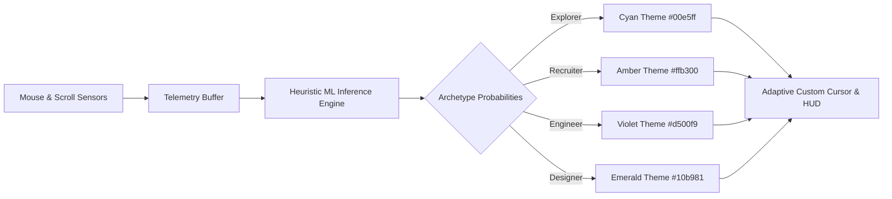

# Abhiral Jain — Creative Full-Stack Developer & ML Engineer Portfolio

<div align="center">


### 🚀 Production-Grade Architectures • Interactive 3D • Sub-200ms ML Inference • Cyberpunk Minimalist UX

[](https://nextjs.org/)
[](https://react.dev/)
[](https://www.typescriptlang.org/)
[](https://tailwindcss.com/)
[](https://threejs.org/)
[](https://greensock.com/gsap/)
[](https://lenis.darkroom.engineering/)
[](https://supabase.com/)

[**Live Experience**](https://github.com/AbhiralJain07/AbhiralJain) • [**Explore Projects**](#-featured-case-studies) • [**Architecture**](#-architecture--directory-map) • [**Terminal CLI**](#-interactive-terminal-cli-aj_os) • [**CMS Suite**](#-admin-cms--live-database-management) • [**Setup Guide**](#-quickstart--local-development)

</div>

---

## 🌟 Executive Overview

This repository houses the personal portfolio and creative engineering showcase of **Abhiral Jain** — Full-Stack Developer, Machine Learning Engineer, and Researcher / Team Lead at **EvolVIT** (VIT Bhopal University, CSE AI & ML '28).

Designed with an **industrial luxury / cyberpunk aesthetic**, the application merges cutting-edge web graphics with resilient full-stack architecture. Beyond static presentation, the portfolio is an interactive digital playground featuring:

- 🎮 **Client-Side ML Visitor Archetype Classifier (Analytics HUD)**: Real-time telemetry tracking cursor velocity, scroll physics, and interaction density to classify visitors into archetypes (*Explorer*, *Recruiter*, *Designer*, *Engineer*) and dynamically shift UI theme states.
- 💻 **AJ_OS Interactive Terminal CLI**: Fully functional in-browser terminal with synthesized mechanical keystroke audio (Web Audio API), custom command parser, history navigation, and a Matrix digital rain canvas screensaver.
- 🪐 **Interactive 3D Graphics**: Spline 3D embedded scenes, Three.js / React Three Fiber golden-ratio particle sphere, and 60fps GPU-accelerated parallax card tilting.
- 📜 **Scroll-Driven Dynamic Media Expander**: Seamless physics-based scroll transitions expanding hero video/photography into full-bleed page flow.
- 🗄️ **Dual-Mode Headless CMS & Admin Dashboard**: Full CRUD management with reordering, availability toggling, and live Supabase integration paired with an instant zero-config browser sandbox fallback.
- ⚡ **Buttery 60fps Motion**: Lenis momentum smooth scrolling tightly synced with GSAP ScrollTrigger proxies and Framer Motion layout transitions.

---

## 📸 Visual Design & Aesthetic Philosophy

```
┌─────────────────────────────────────────────────────────────────────────────┐
│  Palette Tokens                                                             │
├───────────────────┬─────────────────────────────────────────────────────────┤
│  Background       │  #0b0b0c  (Obsidian Void)                               │
│  Foreground       │  #f5f5f7  (Apple Alabaster / Crisp White)               │
│  Accent (Cyan)    │  #00e5ff  (Electric Neon Cyan — Primary interactive)    │
│  Card Surface     │  #121214  (Deep Graphite)                               │
│  Borders          │  #222226  (Subtle Metallic Stroke)                      │
│  Archetype Amber  │  #ffb300  (Recruiter Telemetry Mode)                    │
│  Archetype Violet │  #d500f9  (Engineer Telemetry Mode)                     │
└───────────────────┴─────────────────────────────────────────────────────────┘
```

- **Typography Pairing**: `Syne` (high-contrast, editorial geometry for dramatic headers) + `Inter` (neutral, high-legibility sans-serif for dense data & technical reading) + Monospace (for real-time telemetry, HUDs, and CLI).
- **Physics-Driven Motion**: Custom CSS spring easing curves (`--spring-easing`, `--bounce-easing`) and elastic spring backings on magnetic buttons.
- **Accessibility & A11y**: Full respect for `prefers-reduced-motion`, coarse vs. fine pointer detection, native keyboard navigation, and semantic HTML5 hierarchy.

---

## 🛠️ Complete Technology Stack

| Layer | Technologies | Purpose |
|---|---|---|
| **Core Framework** | Next.js 14 (App Router), React 18, TypeScript 5 | Server Components, dynamic routing (`/projects/[id]`), metadata SEO, static optimization |
| **Styling & Layout** | Tailwind CSS 3.4, PostCSS, Custom CSS Variables | Design tokens, responsive utility grid, neon glow shaders, custom scrollbars |
| **Animation & Motion** | GSAP 3.15, ScrollTrigger, Framer Motion 13.1, Lenis 1.3 | Kinetic text masks, parallax depth layers, magnetic cursor, smooth momentum scroll |
| **3D & Creative WebGL** | Three.js 0.185, `@react-three/fiber`, `@react-three/drei`, Spline (`@splinetool/react-spline`) | Golden-ratio particle sphere, ambient lighting, embedded interactive 3D robot scene |
| **Audio & Canvas** | Web Audio API, HTML5 Canvas 2D Context | Real-time mechanical click synthesizer, Matrix rain screensaver |
| **Database & Auth** | Supabase JS 2.112, PostgreSQL, LocalStorage Sandbox Fallback | Headless CMS persistence, project CRUD, profile metadata, session management |
| **Icons & Assets** | Lucide React, Custom SVG Icons, Next/Image | Streamlined icons, optimized responsive images, layout shift prevention |

---

## 🏗️ Architecture & Directory Map

```text
AbhiralJain/
├── public/                               # Static distribution assets
│   ├── Abhiral_Jain_Resume.pdf           # Primary verified PDF resume
│   ├── resume.pdf                        # Resume alternate link
│   ├── favicon.ico                       # Platform icon
│   └── projects/                         # Project imagery & portrait cutouts
│       ├── abhiral1.jpeg                 # Main hero cutout portrait
│       ├── abhiral2.jpeg                 # Secondary hero portrait variant
│       ├── atithi.jpg                    # Atithi VMS mockup visual
│       └── crashrisk.jpg                 # CrashRisk ML platform visual
├── src/
│   ├── app/                              # Next.js App Router root
│   │   ├── admin/                        # CMS Authentication & Management
│   │   │   ├── dashboard/                # Protected CMS Workspace
│   │   │   │   └── page.tsx              # Projects CRUD, bio editor, sorting, availability toggle
│   │   │   └── page.tsx                  # Secure Admin Login gate (with Demo Sandbox)
│   │   ├── projects/
│   │   │   └── [id]/                     # Dynamic Project Case Study Route
│   │   │       └── page.tsx              # Deep-dive case study page with tech stacks & live links
│   │   ├── globals.css                   # Tailwind directives, spring easings, custom scrollbars
│   │   ├── layout.tsx                    # Root layout with fonts (Inter & Syne), HUD, Cursor & CLI
│   │   ├── page.tsx                      # Main single-page portfolio experience
│   │   └── template.tsx                  # Framer Motion page wipe transition container
│   ├── components/                       # Interactive UI micro-systems
│   │   ├── ui/                           # Atoms & reusable UI primitives
│   │   │   ├── card.tsx                  # Standardized card container component
│   │   │   ├── scroll-expansion-hero.tsx # Scroll-driven hero video/image expansion system
│   │   │   ├── scroll-expansion-demo.tsx # Demo sandbox for scroll expansion
│   │   │   ├── splite.tsx                # Lazy-loaded Spline 3D scene wrapper
│   │   │   ├── SplineDemo.tsx            # Standalone Spline 3D showcase demo
│   │   │   └── spotlight.tsx             # Radial cursor spotlight gradient
│   │   ├── AnalyticsHUD.tsx              # ML/Heuristic visitor archetype classifier & telemetry
│   │   ├── CustomCursor.tsx              # Fluid dual-ring adaptive magnetic cursor
│   │   ├── HeroParallax.tsx              # 3D interactive parallax tilt card & portrait reveal
│   │   ├── Icons.tsx                     # Custom GitHub & LinkedIn SVG brand icons
│   │   ├── Magnetic.tsx                  # Physics-based spring pull wrapper for CTA buttons
│   │   ├── ParticleSphere.tsx            # Three.js / R3F mathematical particle globe
│   │   ├── SmoothScroll.tsx              # Lenis smooth scroll engine + GSAP ScrollTrigger proxy
│   │   └── TerminalCLI.tsx               # AJ_OS interactive terminal drawer with Matrix mode
│   └── lib/                              # Core utilities & database services
│       ├── supabase.ts                   # Supabase client, schema models, and hybrid localStorage API
│       └── utils.ts                      # Tailwind clsx/twMerge class utility (`cn`)
├── components.json                       # shadcn/ui component configuration
├── next.config.mjs                       # Remote image patterns & asset routing
├── package.json                          # Dependencies and script definitions
├── postcss.config.mjs                    # PostCSS plugin pipeline
├── tailwind.config.ts                    # Custom fonts, extended palette & theme tokens
└── tsconfig.json                         # TypeScript configuration & path aliases (`@/*`)
```

---

## 🧩 Deep Dive: Inside-Out Component Breakdown

### 1. `AnalyticsHUD.tsx` — Real-Time ML Archetype Classifier
A sensory telemetry HUD docked at the bottom of the screen that logs user behavior and computes real-time visitor classification probabilities:
- **Sensors Active**:
  - **Cursor Velocity**: Calculates $dx/dt$ and $dy/dt$ in pixels/second, maintaining a smoothed rolling buffer and detecting speed peaks ($> 1800\text{ px/s}$).
  - **Scroll Dynamics**: Monitors scroll depth percentage and scroll velocity bursts.
  - **Interaction Density**: Tracks hover distributions across *Visual Media*, *Technical Tags*, and *Navigation Elements*.
  - **Dwell & Idle Ratios**: Continuously checks active focus vs. idle time.
- **Archetype Inference Models**:
  - `EXPLORER`: Default balanced discovery state.
  - `RECRUITER`: Fast scroller, high speed-to-dwell ratio, focuses on Resume/Contact and skips heavy tech details.
  - `DESIGNER`: High interaction with 3D canvases, image galleries, particle spheres, slower scroll.
  - `ENGINEER`: High hover concentration on technical tags, case studies, and architecture descriptions.
- **System Synchronization**: Emits custom `archetype-change` window events that seamlessly morph cursor colors (Cyan $\rightarrow$ Amber $\rightarrow$ Violet) and outputs real-time event logs into an inspectable terminal feed.



---

### 2. `TerminalCLI.tsx` — Embedded `AJ_OS` Shell
An interactive command-line environment providing an alternative hacker-friendly way to explore the portfolio:
- **Global Keybinding**: Toggle anywhere using the backtick key (`` ` `` or `~`) or via the top navigation `Terminal / CLI` buttons.
- **Audio Synthesizer**: Uses the browser's native `AudioContext` to generate procedural sine-wave click frequencies on every keystroke, emulating vintage mechanical keycaps.
- **Matrix Mode**: Implements a dedicated HTML5 canvas rendering the classic falling green/cyan digital rain with alpha trailing motion.
- **Command Directory**:
  - `help` — Prints the directory of shell utilities.
  - `about` — Prints Abhiral's background, roles, and engineering mission.
  - `resume` / `cv` — Triggers instant opening of verified resume PDF.
  - `skills` — Queries software stack (Frontend, Backend, ML, Database, Arch).
  - `projects` — Lists all showcased database projects with index numbers.
  - `project <n>` — Dumps full case study breakdown for a specific project.
  - `hud` — Displays current telemetry diagnostics (archetype, cursor velocity, scroll depth).
  - `matrix` — Toggles the full-screen Matrix screensaver.
  - `clear` — Flushes terminal buffer history.
  - `exit` / `close` — Smoothly closes the terminal drawer with GSAP slide-out animation.

---

### 3. `HeroParallax.tsx` — 3D Tilt Card & Depth Stacking
A multi-layered 3D perspective hero visual driven by GSAP `quickTo` 60fps interpolators:
- **Perspective Stacking**:
  - `translateZ(-80px)`: Ambient dotted HUD grid.
  - `translateZ(-60px)`: Radial cyan pulsing light aura.
  - `translateZ(-40px)`: Rotating radar HUD ring.
  - `translateZ(0px)`: Masked giant typography (**ABHIRAL JAIN**).
  - `translateZ(20px)`: HUD targeting brackets with dynamic corner animations on hover.
  - `translateZ(0px)` (Foreground): Precision portrait cutout (`abhiral1.jpeg`) that softens on hover to reveal background typography.
  - `translateZ(45px-55px)`: Monospace system status badges (`[ MODE: DEV_ENG ]`, `{ sys: "sub-200ms_inf" }`).

---

### 4. `ScrollExpandMedia.tsx` — Hero Scroll Expander
An immersive media container that translates user scroll wheel and touch drag gestures into a fluid expansion transition:
- **Media Switcher**: Allows toggling between an ambient looping 4K cosmic video and high-resolution photography.
- **Dynamic Unfold**: As the user scrolls, the centered media card dynamically expands to occupy 100% of the viewport width while revealing hero headline content and biography text.

---

### 5. `ParticleSphere.tsx` — Three.js / React Three Fiber Globe
A lightweight WebGL sphere constructed with mathematical precision:
- **Fibonacci Point Distribution**: Generates 1,500 point coordinates distributed evenly using spherical golden-ratio algorithms.
- **Interactive Shaders**: Continuous subtle rotation combined with mouse-pointer lerp tilting and sinusoidal breathing wave pulses.
- **Additive Blending**: High-performance point rendering with zero occlusion artifacting.

---

### 6. `CustomCursor.tsx` — Adaptive Magnetic Cursor
- **Dual-Element Fluid Follower**: Small instantaneous inner dot + smoothed lagging outer ring using GSAP `quickTo`.
- **Morphing Modes**:
  - *Default*: Sleek 32px ring with centered dot.
  - *Interactive Hover*: Expands 1.8x with subtle background fill when hovering over buttons, links, or magnetic targets.
  - *Project Card Hover*: Morphs into a 90px wide inspection pill displaying `VIEW` in bold uppercase text.
- **Color Adaptive**: Subscribes to the `AnalyticsHUD` archetype stream to synchronize cursor color in real time.

---

### 7. `SmoothScroll.tsx` — Lenis + GSAP ScrollTrigger Engine
- Synchronizes Lenis smooth scrolling with GSAP `ScrollTrigger.scrollerProxy` on `document.body`.
- Ensures zero layout jank, prevents scroll-hijack conflicts with embedded iframes, and honors system accessibility preferences (`prefers-reduced-motion`).

---

### 8. `Admin CMS & Dashboard` (`/admin` & `/admin/dashboard`)
A full-featured portfolio management suite:
- **Hybrid Data Architecture**:
  - **Live Mode**: Synchronizes directly with Supabase PostgreSQL tables (`projects`, `profile`) and Supabase Auth.
  - **Demo Sandbox Mode**: Automatically activates when Supabase environment variables are omitted, providing instant CRUD capabilities persisted to browser `localStorage` with predefined seed data.
- **Capabilities**:
  - Add, edit, and delete project case studies.
  - Move projects up/down to reorder display priority on the live site.
  - Live edit biography markdown/paragraphs.
  - Instant toggle for availability status (*"Available for select opportunities"* vs. *"Unavailable / Building"*).
  - Floating status toast notifications.

---

## 📂 Featured Case Studies Showcased

```
┌─────────────────────────────────────────────────────────────────────────────┐
│ 01. ATITHI — Multi-Tenant Visitor Management System                         │
├─────────────────────────────────────────────────────────────────────────────┤
│  • Architecture: DPDP Act 2023 compliant, 6-tier RBAC hierarchy             │
│  • Microservices: Self-hosted facial recognition (Python/Flask/InsightFace) │
│  • Integrations: Telegram Bot approval workflows, rate-limiting, i18n       │
│  • Tech Stack: Node.js, Express, MongoDB, React, TypeScript, Python, Flask  │
│  • Repository: https://github.com/AbhiralJain07/visitor-management-system    │
├─────────────────────────────────────────────────────────────────────────────┤
│ 02. CRASHRISK — Aviation Safety Intelligence Platform                       │
├─────────────────────────────────────────────────────────────────────────────┤
│  • Machine Learning: 4-tier risk classification with sub-200ms inference    │
│  • Algorithm: Gradient Boosting Classifier, Scikit-Learn, NumPy, Pandas     │
│  • Simulator: 11-parameter interactive risk engine mapping non-obvious data │
│  • Tech Stack: Python, Flask, Scikit-Learn, React, TypeScript, Render PaaS  │
│  • Repository: https://github.com/AbhiralJain07/CrashRisk                   │
└─────────────────────────────────────────────────────────────────────────────┘
```

---

## 📊 Database Schema (Supabase / PostgreSQL)

If connecting a live Supabase instance, execute the following SQL migration:

```sql
-- 1. Create Projects Table
create table public.projects (
  id text primary key default concat('project-', replace(gen_random_uuid()::text, '-', '')),
  title text not null,
  description text not null,
  long_description text not null,
  technologies text[] not null default '{}',
  image_url text default '',
  project_url text default '',
  github_url text default '',
  sort_order integer default 0,
  created_at timestamp with time zone default timezone('utc'::text, now()) not null
);

-- 2. Create Profile Table
create table public.profile (
  id uuid primary key default gen_random_uuid(),
  bio_text text not null,
  availability_status boolean default true not null,
  updated_at timestamp with time zone default timezone('utc'::text, now()) not null
);

-- 3. Enable Row Level Security (RLS)
alter table public.projects enable row level security;
alter table public.profile enable row level security;

-- Public Read Access Policies
create policy "Allow Public Read Projects" on public.projects for select using (true);
create policy "Allow Public Read Profile" on public.profile for select using (true);

-- Authenticated Admin Write Access Policies
create policy "Allow Admin Manage Projects" on public.projects for all using (auth.role() = 'authenticated');
create policy "Allow Admin Manage Profile" on public.profile for all using (auth.role() = 'authenticated');
```

---

## ⚡ Quickstart & Local Development

### Prerequisites
- [Node.js](https://nodejs.org/) (Version 18.17.0 or higher recommended)
- [npm](https://www.npmjs.com/), [yarn](https://yarnpkg.com/), [pnpm](https://pnpm.io/), or [bun](https://bun.sh/)

### 1. Clone the Repository
```bash
git clone https://github.com/AbhiralJain07/AbhiralJain.git
cd AbhiralJain
```

### 2. Install Dependencies
```bash
npm install
# or
yarn install
# or
pnpm install
```

### 3. Configure Environment Variables (Optional)
Create a `.env.local` file in the root directory:

```env
# Optional: Connect your live Supabase database
NEXT_PUBLIC_SUPABASE_URL=https://your-project.supabase.co
NEXT_PUBLIC_SUPABASE_ANON_KEY=your-supabase-anon-key
```

> **Note**: If you do not provide Supabase credentials, the app **automatically operates in Demo Sandbox Mode**. You can log into `/admin` using:
> - **Email**: `admin`
> - **Password**: `admin`
> All edits will be stored safely in your browser's local sandbox.

### 4. Start the Development Server
```bash
npm run dev
```

Open [http://localhost:3000](http://localhost:3000) in your browser.

---

## ⌨️ CLI Command Cheatsheet (`AJ_OS`)

Open the terminal anywhere by pressing `` ` `` (backtick) or clicking **CLI / Terminal** in the navigation bar.

| Command | Arguments | Description |
|---|---|---|
| `help` | — | Displays the directory of available terminal utilities |
| `about` | — | Prints developer profile, roles, and engineering philosophy |
| `resume` / `cv` | — | Opens and triggers download of Abhiral's verified PDF resume |
| `skills` | — | Queries complete technical stack (Frontend, Backend, ML, Database) |
| `projects` | — | Lists all projects currently in the database |
| `project` | `<index>` | Inspects deep-dive case study for project at index `n` (e.g. `project 1`) |
| `hud` | — | Dumps live telemetry snapshot (archetype, cursor velocity, dwell time) |
| `matrix` | — | Triggers full-screen interactive Matrix digital rain screensaver |
| `clear` | — | Clears all past command outputs from the terminal view |
| `exit` / `close`| — | Smoothly slides out and closes the terminal drawer |

---

## 🚢 Deployment to Production

### Deploy on Vercel
The easiest way to deploy this portfolio is using [Vercel](https://vercel.com):

1. Push your repository to GitHub.
2. Import the repository into your Vercel Dashboard.
3. Configure the `NEXT_PUBLIC_SUPABASE_URL` and `NEXT_PUBLIC_SUPABASE_ANON_KEY` environment variables if using Supabase.
4. Deploy!

### Production Build Check
To test the production build locally before deployment:
```bash
npm run build
npm run start
```

---

## 👤 About the Author

**Abhiral Jain**  
*Creative Full-Stack Developer & Machine Learning Lead*  
🎓 **B.Tech Computer Science & Engineering (AI & ML)** — VIT Bhopal University (2024 – 2028)  
🏢 **Lead Researcher & Development Lead** — EvolVIT  

- **Portfolio**: [https://github.com/AbhiralJain07/AbhiralJain](https://github.com/AbhiralJain07/AbhiralJain)
- **LinkedIn**: [linkedin.com/in/jainabhiral](https://www.linkedin.com/in/jainabhiral/)
- **GitHub**: [@AbhiralJain07](https://github.com/AbhiralJain07)
- **Email**: [jainabhiral7@gmail.com](mailto:jainabhiral7@gmail.com)

---

<div align="center">

Crafted with Next.js 14, Three.js, GSAP, Tailwind CSS, and Passion.  
© 2026 Abhiral Jain. All rights reserved.

</div>
