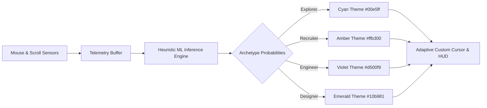

# Abhiral Jain — Creative Full-Stack Developer & ML Engineer Portfolio

<div align="center">


### 🚀 Production-Grade Architectures • Interactive 3D • Sub-200ms ML Inference • Cyberpunk Minimalist UX

[](https://nextjs.org/)
[](https://react.dev/)
[](https://www.typescriptlang.org/)
[](https://tailwindcss.com/)
[](https://threejs.org/)
[](https://greensock.com/gsap/)
[](https://lenis.darkroom.engineering/)
[](https://github.com/AbhiralJain07/AbhiralJain)

[**Live Experience**](https://github.com/AbhiralJain07/AbhiralJain) • [**Explore Projects**](#-featured-case-studies-showcased) • [**Architecture**](#-architecture--directory-map) • [**Components**](#-deep-dive-inside-out-component-breakdown) • [**Terminal CLI**](#-interactive-terminal-cli-aj_os) • [**Setup Guide**](#-quickstart--local-development)

</div>

---

## 🌟 Executive Overview

This repository houses the personal portfolio and creative engineering showcase of **Abhiral Jain** — Full-Stack Developer, Machine Learning Engineer, and Researcher / Team Lead at **EvolVIT** (VIT Bhopal University, CSE AI & ML '28).

Designed with an **industrial luxury / cyberpunk aesthetic**, the application merges cutting-edge web graphics with a lightning-fast, pure frontend architecture. Beyond static presentation, the portfolio is an interactive digital playground featuring:

- 🎮 **Client-Side ML Visitor Archetype Classifier (Analytics HUD)**: Real-time telemetry tracking cursor velocity, scroll physics, and interaction density to classify visitors into archetypes (*Explorer*, *Recruiter*, *Designer*, *Engineer*) and dynamically shift UI theme states.
- 💻 **AJ_OS Interactive Terminal CLI**: Fully functional in-browser terminal with synthesized mechanical keystroke audio (Web Audio API), custom command parser, history navigation, and a Matrix digital rain canvas screensaver.
- 🪐 **Interactive 3D Graphics**: Three.js / React Three Fiber golden-ratio particle sphere, interactive screen-tracking 3D photo card, and 60fps GPU-accelerated parallax card tilting.
- 🧩 **Modular Reusable Architecture**: High-cohesion, isolated UI components (`ProjectCard`, `ExperienceCard`, `SectionHeader`, `MetricsGrid`, `CategoryFilter`, `TechCategoryCard`, `PortalCard`) providing zero code duplication and instant maintainability.
- ⚡ **Zero-Latency Frontend Data Layer**: Clean, type-safe data source (`src/lib/data.ts`) with synchronous TypeScript getters, eliminating external database roundtrips for maximum reliability.
- 📜 **Buttery 60fps Motion**: Lenis momentum smooth scrolling tightly synced with GSAP ScrollTrigger proxies and Framer Motion layout transitions.

---

## 📸 Visual Design & Aesthetic Philosophy

```
┌─────────────────────────────────────────────────────────────────────────────┐
│  Palette Tokens                                                             │
├───────────────────┬─────────────────────────────────────────────────────────┤
│  Background       │  #0b0b0c  (Obsidian Void)                               │
│  Foreground       │  #f5f5f7  (Apple Alabaster / Crisp White)               │
│  Accent (Cyan)    │  #00e5ff  (Electric Neon Cyan — Primary interactive)    │
│  Card Surface     │  #121214  (Deep Graphite)                               │
│  Borders          │  #222226  (Subtle Metallic Stroke)                      │
│  Archetype Amber  │  #ffb300  (Recruiter Telemetry Mode)                    │
│  Archetype Violet │  #d500f9  (Engineer Telemetry Mode)                     │
└───────────────────┴─────────────────────────────────────────────────────────┘
```

- **Typography Pairing**: `Syne` (high-contrast, editorial geometry for dramatic headers) + `Inter` (neutral, high-legibility sans-serif for dense data & technical reading) + Monospace (for real-time telemetry, HUDs, and CLI).
- **Physics-Driven Motion**: Custom CSS spring easing curves (`--spring-easing`, `--bounce-easing`) and elastic spring backings on magnetic buttons.
- **Accessibility & A11y**: Full respect for `prefers-reduced-motion`, coarse vs. fine pointer detection, native keyboard navigation, and semantic HTML5 hierarchy.

---

## 🛠️ Complete Technology Stack

| Layer | Technologies | Purpose |
|---|---|---|
| **Core Framework** | Next.js 14 (App Router), React 18, TypeScript 5 | Component architecture, dynamic routing (`/projects/[id]`), metadata SEO, static builds |
| **Styling & Layout** | Tailwind CSS 3.4, PostCSS, Custom CSS Variables | Design tokens, responsive utility grid, neon glow shaders, custom scrollbars |
| **Animation & Motion** | GSAP 3.15, ScrollTrigger, Framer Motion 13.1, Lenis 1.3 | Kinetic text masks, parallax depth layers, magnetic cursor, smooth momentum scroll |
| **3D & Creative WebGL** | Three.js 0.185, `@react-three/fiber`, `@react-three/drei` | Golden-ratio particle sphere, ambient lighting, WebGL canvas renderers |
| **Audio & Canvas** | Web Audio API, HTML5 Canvas 2D Context | Real-time mechanical click synthesizer, Matrix rain screensaver |
| **Data Architecture** | Pure Frontend Data Layer (`src/lib/data.ts`) | Type-safe static portfolio data, synchronous getters, zero database latency |
| **Icons & Assets** | Lucide React, Custom SVG Icons, Next/Image | Streamlined icons, optimized responsive images, layout shift prevention |

---

## 🏗️ Architecture & Directory Map

```text
AbhiralJain/
├── public/                               # Static distribution assets
│   ├── Abhiral_Jain_Resume.pdf           # Primary verified PDF resume
│   ├── favicon.ico                       # Platform icon
│   ├── logo-white.png                    # Brand vector logo
│   └── projects/                         # Project media assets & cutouts
│       ├── abhiral1.jpeg                 # Main hero cutout portrait
│       ├── abhiral2.jpeg                 # Secondary hero portrait variant
│       ├── atithi.jpg                    # Atithi VMS preview visual
│       ├── crashrisk.jpg                 # CrashRisk ML platform visual
│       └── itsm.jpg                      # ITSM Enterprise platform visual
├── src/
│   ├── app/                              # Next.js App Router root
│   │   ├── experience-projects/          # Work history & featured projects showcase
│   │   │   └── page.tsx                  # Career timeline + category-filtered project grid
│   │   ├── tech-stack-resume/            # Skills matrix & official resume viewer
│   │   │   └── page.tsx                  # Marquee ticker, domain categories & PDF downloader
│   │   ├── get-in-touch/                 # Direct contact & communication hub
│   │   │   └── page.tsx                  # Pre-filled mailto composer & clipboard copier
│   │   ├── projects/
│   │   │   ├── [id]/                     # Dynamic Project Case Study Route
│   │   │   │   └── page.tsx              # Deep-dive case study page with specs & live links
│   │   │   └── page.tsx                  # Clean redirect to /experience-projects#projects-section
│   │   ├── globals.css                   # Global theme tokens, spring easings, scrollbars
│   │   ├── layout.tsx                    # Root layout with fonts (Inter & Syne), HUD, Cursor & CLI
│   │   ├── page.tsx                      # Main landing page experience
│   │   └── template.tsx                  # Framer Motion page transition container
│   ├── components/                       # Modular Reusable UI Systems
│   │   ├── ProjectCard.tsx               # Reusable project card with tags, live demo & GitHub links
│   │   ├── ExperienceCard.tsx            # Reusable timeline card with organization, role & highlights
│   │   ├── SectionHeader.tsx             # Standardized section header with cyan line & mono badge
│   │   ├── MetricsGrid.tsx               # Executive metrics display (cards & compact modes)
│   │   ├── CategoryFilter.tsx            # Pill-tab category selector buttons
│   │   ├── TechCategoryCard.tsx          # Domain-wise technology skill card with icons
│   │   ├── PortalCard.tsx                # Home page multi-portal directory navigation card
│   │   ├── AnalyticsHUD.tsx              # ML visitor archetype classifier & real-time telemetry
│   │   ├── CustomCursor.tsx              # Fluid dual-ring adaptive magnetic cursor
│   │   ├── HeroParallax.tsx              # 3D interactive parallax tilt card & portrait reveal
│   │   ├── InteractivePhotoCard.tsx      # Screen-tracking 3D perspective portrait visual
│   │   ├── Icons.tsx                     # Custom GitHub & LinkedIn SVG brand icons
│   │   ├── Magnetic.tsx                  # Physics-based spring pull wrapper for CTA buttons
│   │   ├── ParticleSphere.tsx            # Three.js / R3F mathematical particle globe
│   │   ├── SmoothScroll.tsx              # Lenis smooth scroll engine + GSAP ScrollTrigger proxy
│   │   ├── TerminalCLI.tsx               # AJ_OS interactive terminal drawer with Matrix mode
│   │   ├── Navbar.tsx                    # Glassmorphism floating header navigation
│   │   └── Footer.tsx                    # Comprehensive platform footer & coordinates
│   └── lib/                              # Core utilities & data services
│       ├── data.ts                       # Verified static projects, experiences, and bio data
│       ├── constants.ts                  # Shared project categories & skill arrays
│       └── utils.ts                      # Class merger (`cn`) & image asset resolver
├── next.config.mjs                       # Next.js configuration & image domains
├── package.json                          # Dependencies and script definitions
├── postcss.config.mjs                    # PostCSS plugin pipeline
├── tailwind.config.ts                    # Custom fonts, extended palette & theme tokens
└── tsconfig.json                         # TypeScript configuration & path aliases (`@/*`)
```

---

## 🧩 Deep Dive: Inside-Out Component Breakdown

### 1. `AnalyticsHUD.tsx` — Real-Time ML Archetype Classifier
A sensory telemetry HUD docked at the bottom of the screen that logs user behavior and computes real-time visitor classification probabilities:
- **Sensors Active**:
  - **Cursor Velocity**: Calculates $dx/dt$ and $dy/dt$ in pixels/second, maintaining a smoothed rolling buffer and detecting speed peaks ($> 1800\text{ px/s}$).
  - **Scroll Dynamics**: Monitors scroll depth percentage and scroll velocity bursts.
  - **Interaction Density**: Tracks hover distributions across *Visual Media*, *Technical Tags*, and *Navigation Elements*.
  - **Dwell & Idle Ratios**: Continuously checks active focus vs. idle time.
- **Archetype Inference Models**:
  - `EXPLORER`: Default balanced discovery state.
  - `RECRUITER`: Fast scroller, high speed-to-dwell ratio, focuses on Resume/Contact and skips heavy tech details.
  - `DESIGNER`: High interaction with 3D canvases, image galleries, particle spheres, slower scroll.
  - `ENGINEER`: High hover concentration on technical tags, case studies, and architecture descriptions.
- **System Synchronization**: Emits custom `archetype-change` window events that seamlessly morph cursor colors (Cyan $\rightarrow$ Amber $\rightarrow$ Violet) and outputs real-time event logs into an inspectable terminal feed.



---

### 2. `TerminalCLI.tsx` — Embedded `AJ_OS` Shell
An interactive command-line environment providing an alternative hacker-friendly way to explore the portfolio:
- **Global Keybinding**: Toggle anywhere using the backtick key (`` ` `` or `~`) or via the top navigation `Terminal / CLI` buttons.
- **Audio Synthesizer**: Uses the browser's native `AudioContext` to generate procedural sine-wave click frequencies on every keystroke, emulating vintage mechanical keycaps.
- **Matrix Mode**: Implements a dedicated HTML5 canvas rendering the classic falling green/cyan digital rain with alpha trailing motion.
- **Command Directory**:
  - `help` — Prints the directory of shell utilities.
  - `about` — Prints Abhiral's background, roles, and engineering mission.
  - `resume` / `cv` — Triggers instant opening of verified resume PDF.
  - `skills` — Queries software stack (Frontend, Backend, ML, Database, Arch).
  - `projects` — Lists all showcased projects with index numbers.
  - `project <n>` — Dumps full case study breakdown for a specific project index.
  - `hud` — Displays current telemetry diagnostics (archetype, cursor velocity, scroll depth).
  - `matrix` — Toggles the full-screen Matrix screensaver.
  - `clear` — Flushes terminal buffer history.
  - `exit` / `close` — Smoothly closes the terminal drawer with GSAP slide-out animation.

---

### 3. `HeroParallax.tsx` — 3D Tilt Card & Depth Stacking
A multi-layered 3D perspective hero visual driven by GSAP `quickTo` 60fps interpolators:
- **Perspective Stacking**:
  - `translateZ(-80px)`: Ambient dotted HUD grid.
  - `translateZ(-60px)`: Radial cyan pulsing light aura.
  - `translateZ(-40px)`: Rotating radar HUD ring.
  - `translateZ(0px)`: Masked giant typography (**ABHIRAL JAIN**).
  - `translateZ(20px)`: HUD targeting brackets with dynamic corner animations on hover.
  - `translateZ(0px)` (Foreground): Precision portrait cutout (`abhiral1.jpeg`) that softens on hover to reveal background typography.
  - `translateZ(45px-55px)`: Monospace system status badges (`[ MODE: DEV_ENG ]`, `{ sys: "sub-200ms_inf" }`).

---

### 4. `ParticleSphere.tsx` — Three.js / React Three Fiber Globe
A lightweight WebGL sphere constructed with mathematical precision:
- **Fibonacci Point Distribution**: Generates 1,500 point coordinates distributed evenly using spherical golden-ratio algorithms.
- **Interactive Shaders**: Continuous subtle rotation combined with mouse-pointer lerp tilting and sinusoidal breathing wave pulses.
- **Additive Blending**: High-performance point rendering with zero occlusion artifacting.

---

### 5. `CustomCursor.tsx` — Adaptive Magnetic Cursor
- **Dual-Element Fluid Follower**: Small instantaneous inner dot + smoothed lagging outer ring using GSAP `quickTo`.
- **Morphing Modes**:
  - *Default*: Sleek 32px ring with centered dot.
  - *Interactive Hover*: Expands 1.8x with subtle background fill when hovering over buttons, links, or magnetic targets.
  - *Project Card Hover*: Morphs into a 90px wide inspection pill displaying `VIEW` in bold uppercase text.
- **Color Adaptive**: Subscribes to the `AnalyticsHUD` archetype stream to synchronize cursor color in real time.

---

### 6. `SmoothScroll.tsx` — Lenis + GSAP ScrollTrigger Engine
- Synchronizes Lenis smooth scrolling with GSAP `ScrollTrigger.scrollerProxy` on `document.body`.
- Ensures zero layout jank, prevents scroll-hijack conflicts with embedded iframes, and honors system accessibility preferences (`prefers-reduced-motion`).

---

### 7. Modular Reusable UI Architecture
The presentation layer is built upon modular UI primitives located in `src/components/`:
- **`ProjectCard.tsx`**: Encapsulates project media banner, category chip, live metric badges, tech badges, and magnetic GitHub/Demo buttons.
- **`ExperienceCard.tsx`**: Renders structured career timeline cards with role tags, organization details, milestone highlights, and applied technologies.
- **`SectionHeader.tsx`**: Standardizes visual section headers with cyan accent indicators and mono category labels.
- **`MetricsGrid.tsx`**: Renders executive stats (`50+ Peers`, `100th Club`, `<200ms ML Latency`, `99.9% Reliability`) in both expansive and compact formats.
- **`CategoryFilter.tsx`**: Reusable pill-tab selector for interactive category filtering.
- **`TechCategoryCard.tsx`**: Domain-wise technology containers with icons and interactive hover states.

---

## 📂 Featured Case Studies Showcased

```
┌─────────────────────────────────────────────────────────────────────────────┐
│ 01. ATITHI — Multi-Tenant Visitor Management System                         │
├─────────────────────────────────────────────────────────────────────────────┤
│  • Architecture: DPDP Act 2023 compliant, 6-tier RBAC hierarchy             │
│  • Microservices: Self-hosted facial recognition (Python/Flask/InsightFace) │
│  • Integrations: Telegram Bot approval workflows, rate-limiting, i18n       │
│  • Tech Stack: Node.js, Express, MongoDB, React, TypeScript, Python, Flask  │
│  • Repository: https://github.com/AbhiralJain07/visitor-management-system    │
├─────────────────────────────────────────────────────────────────────────────┤
│ 02. CRASHRISK — Aviation Safety Intelligence Platform                       │
├─────────────────────────────────────────────────────────────────────────────┤
│  • Machine Learning: 4-tier risk classification with sub-200ms inference    │
│  • Algorithm: Gradient Boosting Classifier, Scikit-Learn, NumPy, Pandas     │
│  • Simulator: 11-parameter interactive risk engine mapping non-obvious data │
│  • Tech Stack: Python, Flask, Scikit-Learn, React, TypeScript, Render PaaS  │
│  • Repository: https://github.com/AbhiralJain07/CrashRisk                   │
├─────────────────────────────────────────────────────────────────────────────┤
│ 03. ITSM — Enterprise IT Service Management Platform                        │
├─────────────────────────────────────────────────────────────────────────────┤
│  • Architecture: Realm-based multi-tenant isolation, 3-tier RBAC            │
│  • Automation: C# Background SLA worker for automated breach detection      │
│  • Analytics: Live telemetry & incident resolution charts (Recharts)        │
│  • Tech Stack: Next.js, ASP.NET Core, TypeScript, C#, PostgreSQL, JWT       │
│  • Repository: https://github.com/AbhiralJain07/ITSM                        │
└─────────────────────────────────────────────────────────────────────────────┘
```

---

## ⚡ Quickstart & Local Development

### Prerequisites
- [Node.js](https://nodejs.org/) (Version 18.17.0 or higher recommended)
- [npm](https://www.npmjs.com/), [yarn](https://yarnpkg.com/), [pnpm](https://pnpm.io/), or [bun](https://bun.sh/)

### 1. Clone the Repository
```bash
git clone https://github.com/AbhiralJain07/AbhiralJain.git
cd AbhiralJain
```

### 2. Install Dependencies
```bash
npm install
# or
yarn install
# or
pnpm install
```

### 3. Start the Development Server
```bash
npm run dev
```

Open [http://localhost:3000](http://localhost:3000) in your browser. All data loads instantly from the type-safe static data layer (`src/lib/data.ts`) with zero external database configuration required.

---

## ⌨️ CLI Command Cheatsheet (`AJ_OS`)

Open the terminal anywhere by pressing `` ` `` (backtick) or clicking **CLI / Terminal** in the navigation bar.

| Command | Arguments | Description |
|---|---|---|
| `help` | — | Displays the directory of available terminal utilities |
| `about` | — | Prints developer profile, roles, and engineering philosophy |
| `resume` / `cv` | — | Opens and triggers download of Abhiral's verified PDF resume |
| `skills` | — | Queries complete technical stack (Frontend, Backend, ML, Database) |
| `projects` | — | Lists all showcased projects with index numbers |
| `project` | `<index>` | Inspects deep-dive case study for project at index `n` (e.g. `project 1`) |
| `hud` | — | Dumps live telemetry snapshot (archetype, cursor velocity, dwell time) |
| `matrix` | — | Triggers full-screen interactive Matrix digital rain screensaver |
| `clear` | — | Clears all past command outputs from the terminal view |
| `exit` / `close`| — | Smoothly slides out and closes the terminal drawer |

---

## 🚢 Deployment to Production

### Deploy on Vercel
The easiest way to deploy this portfolio is using [Vercel](https://vercel.com):

1. Push your repository to GitHub.
2. Import the repository into your Vercel Dashboard.
3. Deploy! (Zero environment variable configuration needed).

### Production Build Verification
To test the production bundle locally:
```bash
npm run build
npm run start
```

---

## 👤 About the Author

**Abhiral Jain**  
*Creative Full-Stack Developer & Machine Learning Lead*  
🎓 **B.Tech Computer Science & Engineering (AI & ML)** — VIT Bhopal University (2024 – 2028)  
🏢 **Lead Researcher & Development Lead** — EvolVIT  

- **Portfolio**: [https://github.com/AbhiralJain07/AbhiralJain](https://github.com/AbhiralJain07/AbhiralJain)
- **LinkedIn**: [linkedin.com/in/jainabhiral](https://www.linkedin.com/in/jainabhiral/)
- **GitHub**: [@AbhiralJain07](https://github.com/AbhiralJain07)
- **Email**: [jainabhiral7@gmail.com](mailto:jainabhiral7@gmail.com)

---

<div align="center">

Crafted with Next.js 14, Three.js, GSAP, Tailwind CSS, and Passion.  
© 2026 Abhiral Jain. All rights reserved.

</div>
